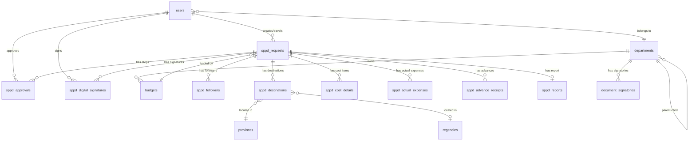

# Desain Database SPPD – Komprehensif & Final (Laravel)

> [!IMPORTANT]
> Dokumen ini adalah hasil **audit menyeluruh** terhadap seluruh source code project SPPD (34 tabel teridentifikasi). Semua fitur yang ada di sistem lama telah dipetakan ke struktur baru ini.

---

## Audit Tabel Lama → Pemetaan ke Tabel Baru

| # | Tabel Lama (CI3) | Tabel Baru (Laravel) | Keterangan |
|---|---|---|---|
| 1 | `table_pegawai` | `users` | Digabung jadi satu |
| 2 | `table_pimpinan` | `users` | Digabung (dibedakan via `employee_type`) |
| 3 | `table_anggotadprd` | `users` | Digabung (dibedakan via `employee_type`) |
| 4 | `users` (Ion Auth) | `users` | Tetap |
| 5 | `groups` (Ion Auth) | Spatie `roles` | Migrasi ke Spatie Permission |
| 6 | `table_skpd` | `departments` | Digabung dengan hierarki |
| 7 | `table_bagian` | `departments` | Jadi child dari Setda |
| 8 | `table_subbagian` | `departments` | Jadi child dari Bagian |
| 9 | `table_asisten` | `departments` | Jadi level hierarki |
| 10 | `table_relasi_sekda` | `user_department_assignments` | Tabel pivot baru |
| 11 | `table_relasi_kelurahan` | `user_department_assignments` | Tabel pivot baru |
| 12 | `table_anggaran` | `budgets` | Tetap terpisah |
| 13 | `table_telaah` | `sppd_requests` | Tabel inti SPPD |
| 14 | `table_pengikut` | `sppd_followers` | Tetap terpisah |
| 15 | `table_lokasi_tujuan` | `sppd_destinations` | Tetap terpisah |
| 16 | `table_tanggal_perjalanan` | Kolom di `sppd_requests` | Disederhanakan |
| 17 | `table_timeline1` s/d `table_timeline10` | `sppd_approvals` | **Digabung 1 tabel** |
| 18 | `table_rincian_biaya` | `sppd_cost_details` | Tetap terpisah |
| 19 | `table_pengeluaran_rill` | `sppd_actual_expenses` | Tetap terpisah |
| 20 | `table_kuitansi_panjar` | `sppd_advance_receipts` | Tetap terpisah |
| 21 | `table_pptk_perjalanan` | Kolom di `sppd_requests` | Disederhanakan |
| 22 | `table_laporanperjalanan` | `sppd_reports` | Tetap terpisah |
| 23 | `table_tte` | `sppd_digital_signatures` | Tetap terpisah |
| 24 | `table_tanda_tangan` | `document_signatories` | Tetap terpisah |
| 25 | `table_rekening` | `bank_accounts` | Tetap terpisah |
| 26 | `table_provinsi` | `provinces` | Referensi wilayah |
| 27 | `table_kabkot` | `regencies` | Referensi wilayah |
| 28 | `table_kecamatan` | Di dalam `departments` | Tergabung |
| 29 | `table_setting` | `settings` | Konfigurasi global |
| 30 | `table_jabatan` | `positions` | Referensi jabatan |
| 31 | `table_golongan` | `ranks` | Referensi golongan |
| 32 | `table_kategori` | `sppd_categories` | Referensi kategori |
| 33 | `table_notifikasi` | `notifications` (Laravel built-in) | Bawaan Laravel |
| 34 | `table_wip` | Tidak perlu (gunakan status draft) | Dihapus |

---

## 1. Tabel Master & Autentikasi

### `users`

Tabel tunggal untuk **semua** pengguna (menggantikan `table_pegawai`, `table_pimpinan`, `table_anggotadprd`).

- `id` (PK, bigint)
- `department_id` (FK → `departments.id`)
- `name` (Nama lengkap)
- `nip` (NIP, nullable – Anggota DPRD mungkin tidak punya NIP)
- `email` (Unik, untuk login)
- `password`
- `phone` (Nomor telepon)
- `employee_type` (Enum: `'pns'`, `'pimpinan'`, `'dprd'`)
- `rank_id` (FK → `ranks.id`, nullable – Golongan/pangkat)
- `position_id` (FK → `positions.id`, nullable)
- `position_name` (Teks bebas jabatan, misal "Plt. Kadis")
- `photo` (Path foto profil)
- `is_active` (Boolean)
- `remember_token`
- `timestamps`

> [!TIP]
> **Spatie Permission** mengelola tabel `roles`, `permissions`, dan `model_has_roles` secara otomatis. Anda cukup assign role seperti: `$user->assignRole('kepala_opd')`.

### `departments`

Tabel hierarki organisasi (menggantikan `table_skpd`, `table_bagian`, `table_subbagian`, `table_asisten`).

- `id` (PK)
- `parent_id` (FK → `departments.id`, nullable)
- `name` (Nama instansi/bagian)
- `code` (Kode SKPD, opsional)
- `type` (Enum: `'opd'`, `'dinkes'`, `'dprd'`, `'sekretariat'`, `'kecamatan'`, `'kelurahan'`, `'puskesmas'`, `'bagian'`, `'subbagian'`, `'asisten'`)
- `level` (Integer: 0=root, 1=dinas, 2=bidang, 3=seksi — memudahkan query)
- `timestamps`

### `user_department_assignments`

Tabel pivot untuk relasi khusus (menggantikan `table_relasi_sekda` & `table_relasi_kelurahan`). Digunakan ketika seorang user punya relasi tambahan ke bagian/asisten tertentu di luar department utamanya.

- `id` (PK)
- `user_id` (FK → `users.id`)
- `department_id` (FK → `departments.id`)
- `assignment_type` (Enum: `'subbagian'`, `'bagian'`, `'asisten'`)
- `timestamps`

---

## 2. Tabel Referensi

### `positions` (Pengganti `table_jabatan`)
- `id`, `name`, `timestamps`

### `ranks` (Pengganti `table_golongan`)
- `id`, `name`, `group` (Golongan: I, II, III, IV), `timestamps`

### `provinces` (Pengganti `table_provinsi`)
- `id`, `name`, `timestamps`

### `regencies` (Pengganti `table_kabkot`)
- `id`, `province_id` (FK → `provinces.id`), `name`, `timestamps`

### `sppd_categories` (Pengganti `table_kategori`)
- `id`, `name`, `description`, `timestamps`

### `settings` (Pengganti `table_setting`)
- `id`, `key`, `value`, `timestamps`

---

## 3. Tabel Transaksi (Inti SPPD)

### `budgets` (Pengganti `table_anggaran`)

- `id` (PK)
- `department_id` (FK → `departments.id`)
- `name` (Nama kegiatan/mata anggaran)
- `year` (Tahun anggaran, integer)
- `total_amount` (Pagu anggaran, decimal)
- `timestamps`

### `sppd_requests` (Pengganti `table_telaah`)

- `id` (PK)
- `user_id` (FK → `users.id` — pelaksana perjalanan)
- `creator_id` (FK → `users.id` — pembuat draft)
- `pptk_id` (FK → `users.id`, nullable — PPTK penanggungjawab)
- `budget_id` (FK → `budgets.id` — sumber anggaran)
- `category_id` (FK → `sppd_categories.id`)
- `purpose` (Maksud perjalanan)
- `start_date` (Tanggal berangkat)
- `end_date` (Tanggal kembali)
- `domain` (Enum: `'dalam_daerah'`, `'luar_daerah'`, `'bimtek'` — domain perjalanan)
- `status` (Enum: `'draft'`, `'in_progress'`, `'approved'`, `'rejected'`, `'completed'`)
- `document_number` (Nomor surat, diisi saat final)
- `notes` (Catatan tambahan)
- `is_secretariat` (Boolean — penanda apakah telaah sekretariat, menggantikan `telaah_sekretariat`)
- `timestamps`

### `sppd_destinations` (Pengganti `table_lokasi_tujuan`)

Satu SPPD bisa punya banyak tujuan.

- `id` (PK)
- `sppd_request_id` (FK → `sppd_requests.id`)
- `province_id` (FK → `provinces.id`)
- `regency_id` (FK → `regencies.id`, nullable)
- `address` (Alamat detail tujuan, opsional)
- `timestamps`

### `sppd_followers` (Pengganti `table_pengikut`)

- `id` (PK)
- `sppd_request_id` (FK → `sppd_requests.id`)
- `user_id` (FK → `users.id`)
- `notes` (Keterangan, nullable)
- `timestamps`

---

## 4. Tabel Keuangan

### `sppd_cost_details` (Pengganti `table_rincian_biaya`)

Rincian biaya **estimasi** per orang per SPPD (diisi sebelum berangkat).

- `id` (PK)
- `sppd_request_id` (FK → `sppd_requests.id`)
- `user_id` (FK → `users.id` — siapa yang menanggung biaya ini)
- `description` (Uraian biaya, misal: "Tiket pesawat", "Uang harian")
- `unit_cost` (Tarif satuan, decimal)
- `quantity` (Jumlah item, integer)
- `total` (Computed: `unit_cost * quantity`)
- `timestamps`

### `sppd_actual_expenses` (Pengganti `table_pengeluaran_rill`)

Pengeluaran **riil** per orang per SPPD (diisi setelah pulang, sebagai bukti pertanggungjawaban).

- `id` (PK)
- `sppd_request_id` (FK → `sppd_requests.id`)
- `user_id` (FK → `users.id`)
- `description` (Uraian pengeluaran)
- `amount` (Jumlah pengeluaran riil, decimal)
- `receipt_file` (Path file bukti/nota)
- `timestamps`

### `sppd_advance_receipts` (Pengganti `table_kuitansi_panjar`)

Kuitansi panjar / uang muka perjalanan.

- `id` (PK)
- `sppd_request_id` (FK → `sppd_requests.id`)
- `user_id` (FK → `users.id`)
- `amount` (Jumlah panjar)
- `receipt_number` (Nomor kuitansi)
- `receipt_file` (Path file kuitansi)
- `timestamps`

### `bank_accounts` (Pengganti `table_rekening`)

Data rekening bank pegawai untuk pencairan dana.

- `id` (PK)
- `user_id` (FK → `users.id`)
- `bank_name`
- `account_number`
- `account_holder`
- `timestamps`

---

## 5. Tabel Workflow & Persetujuan

### `sppd_approvals` (Pengganti `table_timeline1` s/d `table_timeline10`)

- `id` (PK)
- `sppd_request_id` (FK → `sppd_requests.id`)
- `approver_id` (FK → `users.id`)
- `role_label` (String — label jabatan penyetuju saat itu, misal: "Kasubag", "Sekda", "Walikota")
- `step_order` (Integer — urutan langkah)
- `status` (Enum: `'pending'`, `'approved'`, `'rejected'`, `'revision'`)
- `acted_at` (Timestamp, nullable)
- `notes` (Catatan penyetuju, nullable)
- `timestamps`

> [!NOTE]
> **Alur DPRD vs OPD** — Perbedaannya hanya terletak pada **siapa yang menjadi `approver_id` dan berapa banyak `step_order`** yang dibuat saat SPPD di-submit. Contoh:
> - **Staff OPD**: Step 1 = Kasubid → Step 2 = Sekdis → Step 3 = Kadis
> - **Anggota DPRD**: Step 1 = Staff DPRD → Step 2 = Kasubid DPRD → Step 3 = Sekwan → Step 4 = Pimpinan DPRD
> - **Kepala OPD (luar daerah)**: Step 1 = Asisten → Step 2 = Sekda → Step 3 = Walikota
> 
> Semua alur ini **menggunakan tabel yang sama**, hanya beda konfigurasi baris data.

---

## 6. Tabel Tanda Tangan Digital (TTE)

### `sppd_digital_signatures` (Pengganti `table_tte`)

Mencatat status tanda tangan elektronik (TTE) pada dokumen SPPD.

- `id` (PK)
- `sppd_request_id` (FK → `sppd_requests.id`)
- `signer_id` (FK → `users.id` — siapa yang harus menandatangani)
- `status` (Enum: `'pending'`, `'signed'`, `'rejected'`)
- `signed_at` (Timestamp, nullable)
- `signature_data` (Text/blob — data tanda tangan digital atau hash)
- `certificate_serial` (Nomor sertifikat elektronik, nullable)
- `timestamps`

> [!IMPORTANT]
> **Cara kerja TTE di sistem ini:**
> 1. Setelah SPPD disetujui (semua `sppd_approvals` berstatus `approved`), sistem **membuat record di `sppd_digital_signatures`** untuk pejabat yang berwenang menandatangani (misal: Kepala OPD / Walikota).
> 2. Pejabat tersebut login, melihat daftar dokumen yang perlu ditandatangani.
> 3. Saat pejabat menekan "Tanda Tangani", sistem menyimpan data tanda tangan (bisa berupa gambar TTD, hash sertifikat BSrE, atau integrasi dengan API TTE Pemerintah).
> 4. Tabel `sppd_digital_signatures` menyimpan status (`signed`), waktu tanda tangan (`signed_at`), dan referensi sertifikat (`certificate_serial`).
> 5. Dokumen yang sudah di-TTE tidak bisa diubah lagi (immutable).

### `document_signatories` (Pengganti `table_tanda_tangan`)

Template pejabat penandatangan per instansi (siapa saja yang berhak menandatangani dokumen SPPD di suatu SKPD).

- `id` (PK)
- `department_id` (FK → `departments.id`)
- `user_id` (FK → `users.id`, nullable — bisa kosong jika belum ditentukan)
- `position_id` (FK → `positions.id`)
- `name` (Nama pejabat)
- `title` (Jabatan yang tercetak di dokumen)
- `signature_image` (Path gambar tanda tangan basah, untuk cetak)
- `is_active` (Boolean)
- `timestamps`

---

## 7. Tabel Laporan & Dokumentasi

### `sppd_reports` (Pengganti `table_laporanperjalanan`)

- `id` (PK)
- `sppd_request_id` (FK → `sppd_requests.id`)
- `report_text` (Isi laporan kegiatan)
- `receipt_file` (Path file bukti nota utama)
- `documentation_file` (Path file foto dokumentasi)
- `total_expense` (Total pengeluaran riil keseluruhan)
- `verification_status` (Enum: `'pending'`, `'verified'`, `'returned'` — status verifikasi bendahara)
- `verified_by` (FK → `users.id`, nullable)
- `verified_at` (Timestamp, nullable)
- `timestamps`

---

## 8. Tabel Pendukung

### `activity_logs` (Pengganti `table_log` via Spatie)

Gunakan package **`spatie/laravel-activitylog`** — tidak perlu buat tabel manual.

### `notifications` (Laravel Built-in)

Gunakan sistem notifikasi bawaan Laravel (`php artisan notifications:table`).

---

## Diagram Relasi (ERD Ringkas)



---

## Penjelasan Relasi Eloquent

| # | Relasi | Tipe | Eloquent |
|---|---|---|---|
| 1 | User → Department | BelongsTo | `$user->department` |
| 2 | Department → Children | HasMany (self) | `$dept->children` |
| 3 | Department → Parent | BelongsTo (self) | `$dept->parent` |
| 4 | SppdRequest → User (pelaksana) | BelongsTo | `$sppd->user` |
| 5 | SppdRequest → User (pembuat) | BelongsTo | `$sppd->creator` |
| 6 | SppdRequest → Budget | BelongsTo | `$sppd->budget` |
| 7 | SppdRequest → Followers | HasMany | `$sppd->followers` |
| 8 | SppdRequest → Destinations | HasMany | `$sppd->destinations` |
| 9 | SppdRequest → Approvals | HasMany (ordered) | `$sppd->approvals` |
| 10 | SppdRequest → CostDetails | HasMany | `$sppd->costDetails` |
| 11 | SppdRequest → ActualExpenses | HasMany | `$sppd->actualExpenses` |
| 12 | SppdRequest → AdvanceReceipts | HasMany | `$sppd->advanceReceipts` |
| 13 | SppdRequest → Report | HasOne | `$sppd->report` |
| 14 | SppdRequest → DigitalSignatures | HasMany | `$sppd->digitalSignatures` |
| 15 | SppdApproval → User (approver) | BelongsTo | `$approval->approver` |
| 16 | Budget → SppdRequests | HasMany | `$budget->sppdRequests` |
| 17 | Budget → Department | BelongsTo | `$budget->department` |

---

## Perbedaan Alur DPRD vs OPD

> [!IMPORTANT]
> Dalam desain baru ini, **DPRD dan OPD menggunakan struktur tabel yang 100% sama**. Perbedaannya hanya pada **konfigurasi workflow** (siapa approver dan berapa step). Berikut perbandingannya:

### Alur OPD (Eselon III, IV & Staf)
```
Staff input SPPD → Kasubid (step 1) → Sekdis (step 2) → Kadis (step 3) → [TTE]
```

### Alur Kepala OPD (Luar Daerah)
```
Admin OPD input → Asisten (step 1) → Sekda (step 2) → Walikota (step 3) → [TTE]
```

### Alur Anggota DPRD
```
Staff DPRD input → Kasubid DPRD (step 1) → Sekwan (step 2) → Pimpinan DPRD (step 3) → [TTE]
```

### Alur Sekretariat Daerah
```
Kasubag input → Kabag (step 1) → Asisten (step 2) → Sekda (step 3) → [TTE jika luar daerah]
```

### Alur Kecamatan/Kelurahan
```
Staff input → Sekretaris Camat (step 1) → Camat (step 2) → [TTE]
```

### Alur Puskesmas
```
Staff input → Kasubag (step 1) → Kapus (step 2) → [TTE]
```

Semua alur di atas dikelola melalui **satu tabel `sppd_approvals`** + **satu service class** `WorkflowService` yang menentukan step berdasarkan role dan department type user.

---

## Checklist Fitur yang Sudah Tercakup

- [x] Login & Manajemen User (Ion Auth → Laravel Auth + Spatie)
- [x] Struktur Organisasi Hierarkis (SKPD, Bagian, Subbagian, Asisten)
- [x] Relasi Khusus Sekda (user ↔ subbagian/bagian/asisten)
- [x] Anggaran per SKPD per Tahun
- [x] Pengajuan SPPD (Telaah) + Domain Perjalanan (DD/LD/Bimtek)
- [x] Lokasi Tujuan (Multi-tujuan, Provinsi + Kab/Kota)
- [x] Pengikut Perjalanan
- [x] Rincian Biaya Estimasi (per orang)
- [x] Pengeluaran Riil (per orang, dengan bukti nota)
- [x] Kuitansi Panjar
- [x] Workflow Persetujuan Berjenjang (11 alur → 1 tabel)
- [x] Tanda Tangan Elektronik (TTE)
- [x] Template Pejabat Penandatangan per SKPD
- [x] Laporan Perjalanan + Verifikasi Bendahara
- [x] Data Rekening Bank Pegawai
- [x] Export/Cetak Dokumen (SPT, SPD, Kuitansi)
- [x] Referensi Wilayah (Provinsi, Kabupaten/Kota)
- [x] Referensi Jabatan & Golongan
- [x] Log Aktivitas
- [x] Notifikasi
- [x] Kalender Perjalanan
- [x] Kop Surat (via `settings` atau file konfigurasi)
- [x] PPTK (Pejabat Penatausahaan Keuangan)
